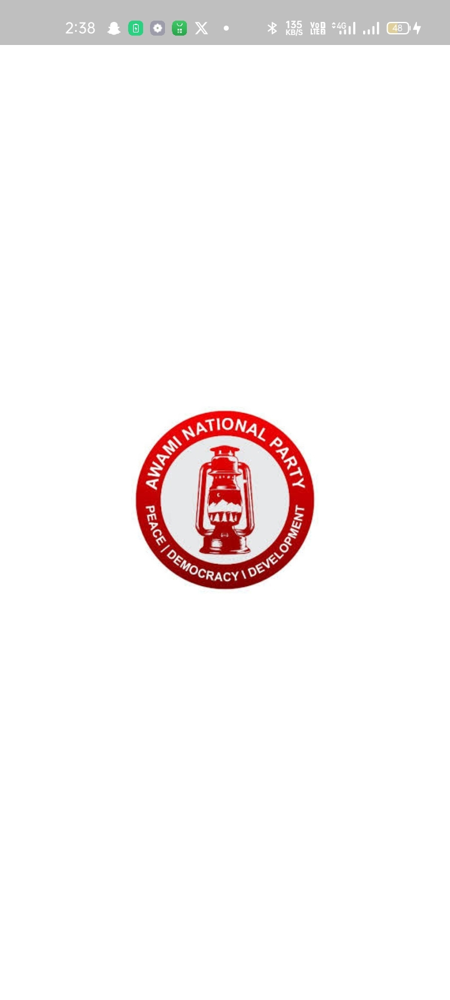
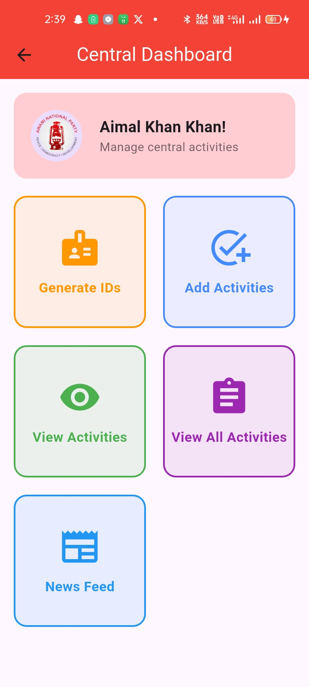
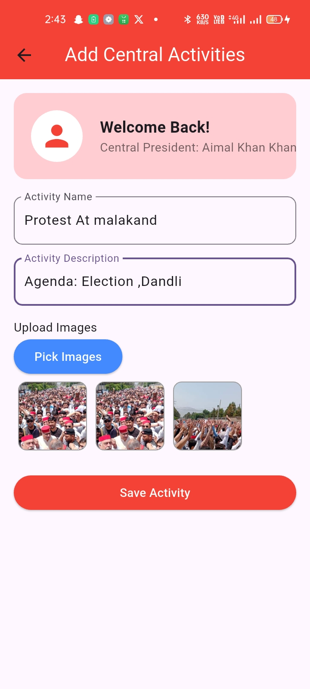
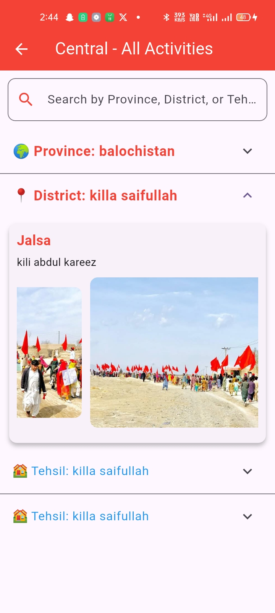
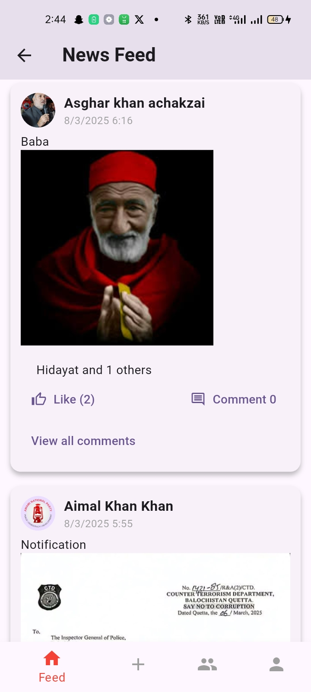

# ANP Management App

**ANP Management App** is a level-based tool designed to streamline and monitor activities across administrative levels within a political party. Tailored for private use, it ensures only authorized members can access sensitive data. Built with **Firebase** for real-time management, the app provides a robust platform for hierarchical activity tracking.

## Key Features:
- **Hierarchical Activity Management:**
  - **Units:** Add/view unit-level activities and view Tehsil-level activities.
  - **Tehsil:** Add Tehsil-level activities and view district-level activities.
  - **District:** Add district-level activities, view province-level activities, and monitor unit activities.
  - **Province:** View activities across districts, tehsils, and units within the province.
  - **Central:** Access activities across all provinces, districts, tehsils, and units.

- **Private Access:**  
  Restricted to authorized party members, ensuring secure internal data access.

- **Public News Feed:**  
  A public section showcases party announcements and activities, accessible to everyone.

- **Real-Time Data Management:**  
  Firebase ensures real-time synchronization, instantly reflecting updates.

- **User-Friendly Interface:**  
  Clean and intuitive design for easy navigation and activity management.

## Screenshots
Here are some screenshots of the app:

<table>
  <tr>
    <td></td>
    <td></td>
  </tr>
  <tr>
    <td>*Splash Screen*</td>
    <td>*Central Dashboard*</td>
  </tr>
  <tr>
    <td></td>
    <td></td>
  </tr>
  <tr>
    <td>*Add Activities Screen*</td>
    <td>*View Activities Screen*</td>
  </tr>
  <tr>
    <td colspan="2"></td>
  </tr>
  <tr>
    <td colspan="2">*News Feed Screen*</td>
  </tr>
</table>

## Technology Stack:
- **Backend:** Firebase (Authentication, Realtime Database, Firestore)
- **Frontend:** Flutter

This app is ideal for internal party use, providing a secure and efficient way to manage activities across all levels. Unauthorized access is strictly prohibited.